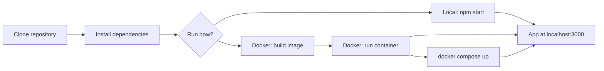
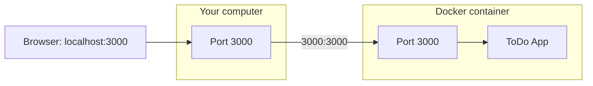
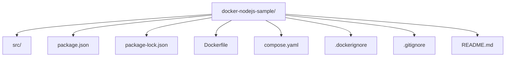

# ToDo App

A simple ToDo application built with Node.js and containerized with Docker.

## Project Description

This application lets you create and manage simple ToDo entries. It was built as part of the final assignment **Development Fundamentals 2026**, applying the topics **Markdown, Git, GitHub, and Docker**.

The application can run either locally with Node.js or inside a Docker container, as shown below.



## Prerequisites

* [Node.js](https://nodejs.org/) (version 24 or newer)
* [Docker](https://www.docker.com/)
* [Git](https://git-scm.com/)

## Cloning the Repository

Clone the repository from GitHub:

```bash
git clone YOUR-REPOSITORY-URL
```

Then move into the project directory:

```bash
cd docker-nodejs-sample
```

## Installing Dependencies

Install the required Node.js dependencies:

```bash
npm install
```

## Running the Application Locally

Start the application with:

```bash
npm start
```

The application is then available at `http://localhost:3000`.

## Building the Docker Image

Build the Docker image with:

```bash
docker build -t todo-app .
```

What each part means:

* `docker build` creates a new Docker image.
* `-t todo-app` tags the image with the name `todo-app`.
* `.` uses the current directory as the build context.

## Running the Application with Docker

Start the container with:

```bash
docker run --name todo-container -p 3000:3000 todo-app
```

The port mapping `3000:3000` follows the pattern `HOST:CONTAINER`. The first port is on your own machine, the second port is inside the container.



The application is then available at `http://localhost:3000`.

## Viewing Running Containers

```bash
docker ps
```

This lists all currently running containers.

## Running the Application with Docker Compose

Docker Compose manages the container settings through the `compose.yaml` file.

Start the application with:

```bash
docker compose up --build
```

`--build` rebuilds the Docker image before starting.

### Running in the Background

```bash
docker compose up -d
```

`-d` stands for `detached` and runs the container in the background.

### Checking Status

```bash
docker compose ps
```

### Stopping Docker Compose

```bash
docker compose down
```

## Stopping the Application

If the container was started with `docker run`:

```bash
docker stop todo-container
```

Then remove the container:

```bash
docker rm todo-container
```

With Docker Compose:

```bash
docker compose down
```

## Applying Code Changes

If the source code has changed, the Docker image must be rebuilt:

```bash
docker compose up -d --build
```

The changes are then present inside the container.

## Git and GitHub

Changes are versioned with Git throughout development.

### Checking Status

```bash
git status
```

### Staging Changes

```bash
git add .
```

### Committing Changes

Examples of clear commit messages:

```bash
git commit -m "Add Dockerfile"
git commit -m "Add Docker Compose configuration"
git commit -m "Update README"
```

### Pushing Changes to GitHub

```bash
git push
```

## Project Structure

The key files in this project:



## Docker Files

### Dockerfile

The `Dockerfile` describes how the Docker image is built.

### .dockerignore

The `.dockerignore` file defines which files are excluded when building the Docker image, for example:

* `node_modules/`
* `npm-debug.log*`
* `.git/`
* `.gitignore`
* `README.md`

The `node_modules` folder is excluded because the required packages are installed inside the Docker image itself.

### compose.yaml

The `compose.yaml` file holds the Docker Compose settings, which makes starting and stopping the application much simpler.

## Troubleshooting

### Port 3000 Is Already in Use

If port 3000 is already taken, use a different port on your machine, for example:

```bash
docker run --name todo-container -p 3001:3000 todo-app
```

The application would then be available at `http://localhost:3001`.

### Changes Are Not Showing Up

If a source code change is not visible, the image needs to be rebuilt:

```bash
docker compose up -d --build
```

## Key Commands

| Task | Command |
|---|---|
| Install dependencies | `npm install` |
| Run application locally | `npm start` |
| Build Docker image | `docker build -t todo-app .` |
| List images | `docker image ls` |
| Start container | `docker run --name todo-container -p 3000:3000 todo-app` |
| List containers | `docker ps` |
| Stop container | `docker stop todo-container` |
| Remove container | `docker rm todo-container` |
| Start with Compose | `docker compose up --build` |
| Start with Compose in background | `docker compose up -d` |
| Show Compose status | `docker compose ps` |
| Stop Compose | `docker compose down` |

## Summary

With this setup, the ToDo application can run both locally with Node.js and inside a Docker container.

This README documents the key steps, from installation through the local start to containerization with Docker and Docker Compose.